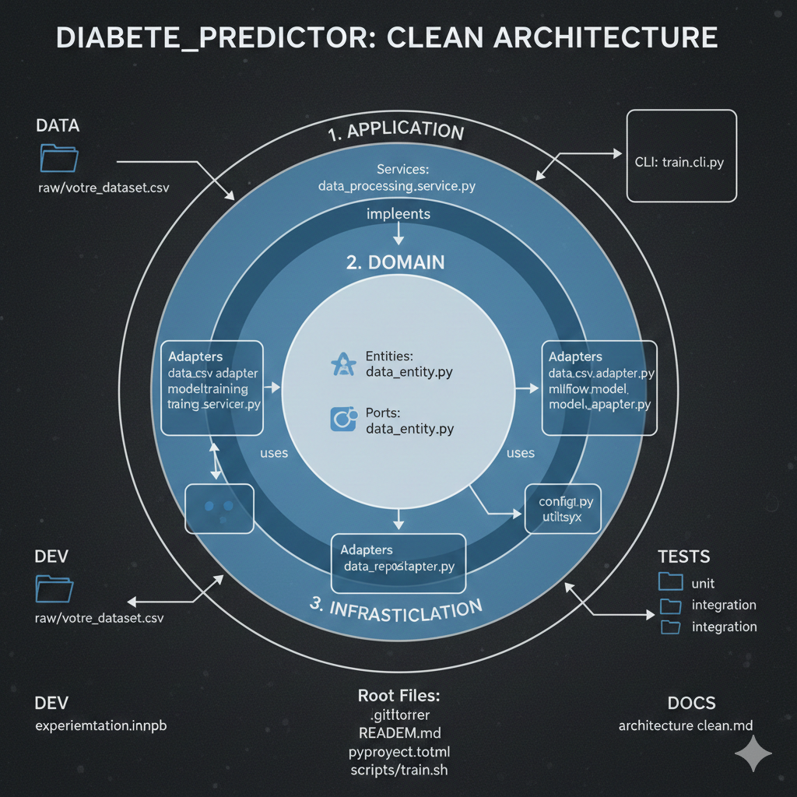

# ⚕️ Health & Lifestyle Diabetes Prediction

**Un projet Machine Learning pédagogique basé sur la Clean Architecture et les bonnes pratiques MLOps**

[](https://www.python.org/)
[](https://python-poetry.org/)
[](https://mlflow.org/)
[](https://fastapi.tiangolo.com/)
[](LICENSE)

---

## 📌 Présentation du projet

Ce projet est un **système de Machine Learning dédié à la prédiction du diabète**, construit avec une forte orientation **Clean Architecture appliquée aux projets de Data Science**.

L'objectif de ce dépôt **n'est pas** de proposer un simple projet de modélisation ou un notebook expérimental, mais de montrer **comment concevoir, structurer et organiser un projet de Machine Learning de manière professionnelle**, en respectant des principes d'architecture logicielle utilisés en entreprise.

### 📊 Dataset utilisé

Le projet s'appuie sur le dataset **[Health & Lifestyle Data for Diabetes Prediction](https://www.kaggle.com/datasets/alamshihab075/health-and-lifestyle-data-for-diabetes-prediction)** disponible sur Kaggle.

Ce dataset preprocessé contient des données de santé et de mode de vie permettant de réaliser :
- Des analyses exploratoires (EDA)
- De la régression
- De la modélisation prédictive

**La véritable valeur ajoutée** de ce projet réside dans la **structure du code**, la **séparation des responsabilités**, et la **vision MLOps** adoptée tout au long du développement.

---

## 🎯 Objectifs pédagogiques

Les objectifs principaux de ce projet sont les suivants :

### Architecture & Code Quality
* ✅ Appliquer les **principes de la Clean Architecture** à un projet de Data Science
* ✅ Montrer comment structurer un projet ML de manière claire et maintenable
* ✅ Séparer proprement :
  - la logique métier (domain)
  - les cas d'usage (application)
  - les implémentations techniques (infrastructure)
  - les interfaces d'exposition (presentation)

### Machine Learning Engineering
* ✅ Illustrer un **workflow de Machine Learning Engineer** proche des standards industriels
* ✅ Mettre en œuvre les **bonnes pratiques MLOps** (CI/CD, tracking, configuration, API)
* ✅ Garantir la **reproductibilité** et la **traçabilité** des expérimentations

### Cas d'usage métier
D'un point de vue modélisation, le projet traite :
* 🔹 **Classification binaire** (diabète / non-diabète)
* 🔹 **Classification multi-classes** (stades du diabète)
* 🔹 **Estimation de risque** à partir d'indicateurs de santé et de mode de vie

---

## 🏗️ Approche architecturale

Ce projet est structuré selon les principes de la **Clean Architecture**, adaptés aux **projets de Data Science et de Machine Learning**.

L'idée centrale est de **séparer clairement ce que fait le système** de **la manière dont il est implémenté**, afin de construire un code :

- ✨ plus lisible
- 🧪 plus testable
- 🔄 plus évolutif
- 🚀 plus proche des exigences de la production

### 🤔 Pourquoi appliquer la Clean Architecture en Data Science ?

Dans de nombreux projets ML, on observe rapidement les problèmes suivants :

| ❌ Problème | ✅ Solution Clean Architecture |
|-------------|-------------------------------|
| Notebooks difficiles à maintenir | Code modulaire et structuré |
| Mélange des responsabilités | Séparation stricte des couches |
| Changements coûteux | Inversion des dépendances |
| Code non testable | Architecture testable par design |
| Difficultés à passer en production | Infrastructure découplée |

La Clean Architecture permet d'éviter ces écueils en imposant :

* Une **séparation forte des responsabilités**
* Une **inversion des dépendances**
* Une distinction claire entre le cœur métier et les détails techniques

---

### 🧱 Vue d'ensemble de la Clean Architecture



> Ce schéma illustre comment les principes de la Clean Architecture sont appliqués pour structurer un système de Machine Learning robuste et maintenable.

---

### 🧠 Architecture logique (simplifiée)

```
presentation  →  application  →  domain
        ↑                ↑
        └──── infrastructure ─┘
```

#### Responsabilités par couche

| Couche | Responsabilité | Exemples |
|--------|----------------|----------|
| **Domain** | Concepts métier purs | Entités, interfaces, règles métier |
| **Application** | Orchestration des cas d'usage | Training, Evaluation, Prediction |
| **Infrastructure** | Implémentations concrètes | Data loaders, modèles ML, tracking |
| **Presentation** | Exposition du système | API REST, CLI, Dashboard |

**Règle d'or** : Toutes les dépendances **pointent vers l'intérieur**, garantissant la stabilité du cœur du système.

---

## 📁 Structure du projet

```
health_lifestyle_diabetes/
├── 📝 pyproject.toml          # Configuration Poetry
├── 📖 README.md                # Documentation principale
├── 🚫 .gitignore               # Fichiers ignorés
├── 📋 configs/                 # Configuration YAML
│   ├── training.yaml           # Paramètres d'entraînement
│   ├── inference.yaml          # Configuration d'inférence
│   ├── preprocessing.yaml      # Pipeline de preprocessing
│   ├── logging.yaml            # Configuration des logs
│   └── paths.yaml              # Chemins du projet
├── 🧪 tests/                   # Suite de tests
│   ├── domain/                 # Tests du domaine
│   ├── application/            # Tests des cas d'usage
│   ├── infrastructure/         # Tests d'infrastructure
│   └── e2e/                    # Tests end-to-end
└── 📦 src/
    └── health_lifestyle_diabetes/
        ├── 🧠 domain/          # Logique métier pure
        │   ├── entities/       # Entités métier
        │   ├── repositories/   # Interfaces abstraites
        │   └── services/       # Services métier
        ├── 🎯 application/     # Cas d'usage
        │   ├── use_cases/      # Use cases ML
        │   └── dtos/           # Data Transfer Objects
        ├── 🔧 infrastructure/  # Implémentations
        │   ├── data/           # Data loaders
        │   ├── models/         # Modèles ML
        │   ├── preprocessing/  # Feature engineering
        │   └── tracking/       # MLflow tracking
        └── 🌐 presentation/    # Interfaces
            ├── api/            # FastAPI endpoints
            ├── cli/            # Command Line Interface
            └── dashboard/      # Interface utilisateur
```

Cette organisation permet de conserver un projet **clair**, **testable**, **modulaire** et **prêt pour des usages industriels**.

---

## 🤖 Machine Learning & pratiques MLOps

Ce projet illustre comment le Machine Learning **s'intègre naturellement dans une architecture propre**.

### 🔹 Modèles de Machine Learning

Les modèles utilisés sont principalement des **modèles de boosting**, particulièrement adaptés aux données tabulaires :

| Modèle | Usage | Avantages |
|--------|-------|-----------|
| **Gradient Boosting** | Baseline robuste | Performance stable |
| **XGBoost** | Modèle principal | Rapidité et performance |
| **CatBoost** | Variables catégorielles | Gestion native des catégories |

Ces modèles sont entièrement encapsulés dans la couche *infrastructure*, ce qui les rend **facilement interchangeables** sans impacter le reste du système.

### 🔹 Suivi des expérimentations

**MLflow** est utilisé pour garantir la traçabilité complète :

```python
# Exemple de tracking automatique
with mlflow.start_run():
    mlflow.log_params(params)
    mlflow.log_metrics(metrics)
    mlflow.sklearn.log_model(model, "model")
```

Fonctionnalités couvertes :
- 📊 Suivi des expériences et métriques
- 🔖 Versioning des modèles
- 🎯 Comparaison des performances
- 📦 Enregistrement des artifacts
- 🔄 Reproductibilité garantie

### 🔹 Configuration orientée métier

```yaml
# training.yaml
model:
  type: "xgboost"
  params:
    max_depth: 6
    learning_rate: 0.1
    n_estimators: 100

training:
  validation_split: 0.2
  random_state: 42
  stratify: true
```

**Avantages** :
- ✅ Aucun hyperparamètre codé en dur
- ✅ Expérimentations reproductibles
- ✅ Configuration centralisée
- ✅ Séparation config/code

### 🔹 CI/CD et qualité du code

Des pipelines **GitHub Actions** automatisent :

```yaml
# .github/workflows/ci.yml
- Exécution des tests (pytest)
- Vérification du code (ruff, black)
- Analyse statique (mypy)
- Validation de la structure
- Build et packaging
```

Cela montre comment appliquer des pratiques **DevOps** à des projets de **Data Science**.

### 🔹 Inférence via API

**FastAPI** expose les prédictions de manière professionnelle :

```python
@app.post("/predict")
async def predict(data: PatientData) -> PredictionResponse:
    """Endpoint de prédiction découplé de la logique ML"""
    return use_case.predict(data)
```

**Caractéristiques** :
- 🚀 API performante et asynchrone
- 📝 Documentation automatique (OpenAPI/Swagger)
- ✅ Validation des données (Pydantic)
- 🔒 Gestion des erreurs robuste
- 📊 Monitoring des requêtes

---

## 🧪 Technologies utilisées

### Stack principale

| Technologie | Rôle |
|-------------|------|
| **Python 3.9+** | Langage principal |
| **Poetry** | Gestion des dépendances et packaging |

### Data Science & Machine Learning

- **Pandas** - Manipulation de données
- **NumPy** - Calcul numérique
- **Scikit-learn** - Preprocessing et métriques
- **XGBoost** - Gradient boosting optimisé
- **CatBoost** - Boosting pour variables catégorielles

### MLOps & Ingénierie

- **MLflow** - Tracking et versioning des modèles
- **FastAPI** - Framework API moderne
- **GitHub Actions** - CI/CD automatisé
- **YAML** - Configuration déclarative
- **Logging structuré** - Observabilité

### Qualité & Tests

- **pytest** - Framework de tests
- **ruff** - Linter Python moderne
- **black** - Formattage automatique
- **mypy** - Vérification de types

---

## 🚀 Installation et utilisation

### Prérequis

```bash
# Python 3.9 ou supérieur
python --version

# Poetry installé
poetry --version
```

### Installation

```bash
# Cloner le repository
git clone https://github.com/votre-username/health-lifestyle-diabetes.git
cd health-lifestyle-diabetes

# Installer les dépendances
poetry install

# Activer l'environnement virtuel
poetry shell
```

### Utilisation

```bash
# Entraîner un modèle
poetry run python -m health_lifestyle_diabetes.presentation.cli train

# Lancer l'API
poetry run uvicorn health_lifestyle_diabetes.presentation.api.main:app --reload

# Exécuter les tests
poetry run pytest

# Vérifier la qualité du code
poetry run ruff check .
poetry run black --check .
```

---

## 📚 Documentation complémentaire

- 📖 [Guide d'architecture](docs/architecture.md)
- 🎓 [Tutoriel Clean Architecture](docs/clean_architecture_guide.md)
- 🔧 [Configuration](docs/configuration.md)
- 🧪 [Guide de tests](docs/testing.md)
- 🚀 [Déploiement](docs/deployment.md)

---

## 🎓 Objectif pédagogique du projet

Ce dépôt a avant tout une **vocation pédagogique**.

### Ce que vous apprendrez

✨ **Architecture logicielle**
- Appliquer la Clean Architecture à la Data Science
- Concevoir des systèmes ML maintenables
- Gérer les dépendances et le couplage

🔧 **Engineering practices**
- Structurer un projet ML pour le long terme
- Mettre en place CI/CD pour la Data Science
- Implémenter des tests robustes

🚀 **MLOps & Production**
- Tracker et versionner les expérimentations
- Déployer des modèles via API
- Garantir la reproductibilité

🧠 **Mindset**
- Penser en **Machine Learning Engineer**
- Dépasser l'approche notebook
- Adopter une vision orientée production

### Public cible

Ce projet s'adresse à :
- 🎓 Data Scientists souhaitant améliorer leurs compétences en engineering
- 👨‍💻 ML Engineers cherchant des exemples de bonnes pratiques
- 🏢 Équipes voulant adopter une architecture propre pour leurs projets ML
- 📚 Étudiants en Data Science désireux d'apprendre l'architecture logicielle

---

## 🤝 Contribution

Les contributions sont les bienvenues ! N'hésitez pas à :

1. 🍴 Fork le projet
2. 🌱 Créer une branche (`git checkout -b feature/amelioration`)
3. 💾 Commit vos changements (`git commit -m 'Ajout d'une fonctionnalité'`)
4. 📤 Push vers la branche (`git push origin feature/amelioration`)
5. 🎉 Ouvrir une Pull Request

---

## 📜 Licence

Ce projet est sous licence MIT. Voir le fichier [LICENSE](LICENSE) pour plus de détails.

---

## 👤 Auteur

**Rostand Surel**

📧 Email : [rostandsurel@yahoo.com](mailto:rostandsurel@yahoo.com)
🔗 LinkedIn : [Votre profil LinkedIn]
🐙 GitHub : [@votre-username]

---

## ⭐ Remerciements

- 📊 Dataset fourni par [Alam Shihab](https://www.kaggle.com/alamshihab075) sur Kaggle
- 📚 Inspiré par les principes de Clean Architecture de Robert C. Martin
- 🙏 Communauté MLOps pour les bonnes pratiques partagées

---

## 💡 Note finale

Ce projet reflète ma vision des projets de Machine Learning modernes :

> **Architecture claire** + **Séparation des responsabilités** + **Workflows reproductibles** + **Orientation production** = **Projet ML professionnel**

Il constitue une **base pédagogique complète** pour comprendre comment concevoir des projets de Data Science maintenables en appliquant la Clean Architecture.

Si ce projet vous a été utile, n'hésitez pas à lui donner une ⭐ !

---

**Made with ❤️ by Rostand Surel**